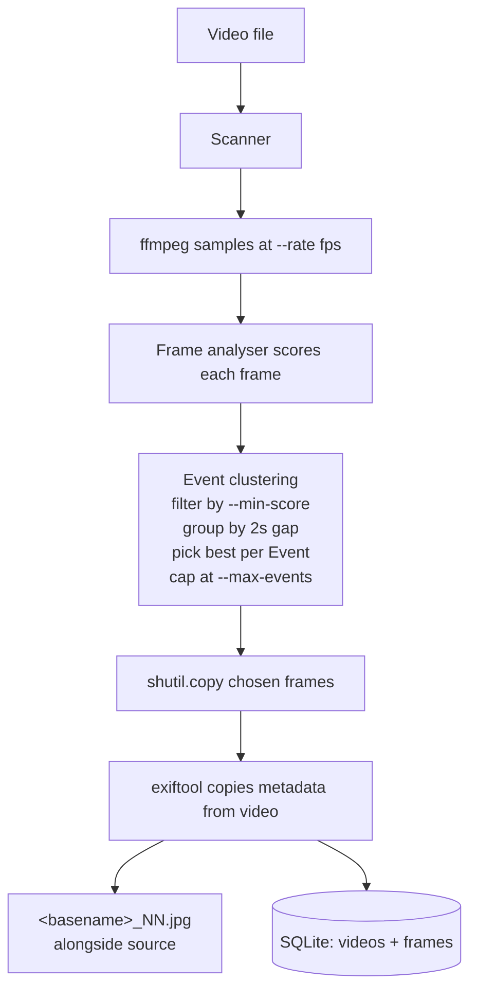

# fathom

Pulls the best frames from scuba diving videos using cheap heuristics, exports them as JPGs with metadata preserved, and gives you a local web UI to review and prune the results.

## Contents

- [Prereqs](#prereqs)
- [Quick start](#quick-start)
- [Architecture](#architecture)
  - [`fathom process` pipeline](#fathom-process-pipeline)
  - [`fathom serve`](#fathom-serve)
  - [Housekeeping](#housekeeping)
  - [Module layout](#module-layout)
- [Further reading](#further-reading)

## Prereqs

```sh
brew install ffmpeg exiftool uv
```

`uv` fetches Python 3.14 itself on the first `uv sync` (it reads `.python-version`). No system Python required.

## Quick start

```sh
uv sync
uv run fathom process /path/to/videos
uv run fathom serve /path/to/videos
```

Open http://localhost:8000.

## Architecture

Two CLI commands with a SQLite handoff between them. `fathom process` does the heavy lifting offline; `fathom serve` is a thin read-only viewer. See [ADR-0004](docs/adr/0004-two-step-cli-workflow.md).

### `fathom process` pipeline



Steps in detail:

1. **Scanner** walks the scan root recursively, yielding video paths (`.mp4`, `.mov`, `.mts`, `.m4v`). Skips hidden folders, doesn't follow symlinks.
2. **ffmpeg** samples each video at `--rate` frames per second (default 3.0) into a temp directory as intermediate JPGs.
3. **Frame analyser** scores every sampled frame. v1 ships `HeuristicAnalyser`: a weighted sum of sharpness (Laplacian variance), edge density (Canny mean), and colour variance (HSV saturation stddev), each normalised to [0, 1]. Pluggable via `--analyser`. See [ADR-0002](docs/adr/0002-frame-analyser-swappable-strategy.md) and [ADR-0001](docs/adr/0001-heuristic-frame-scoring-not-ml.md).
4. **Event clustering** drops frames below `--min-score` (default 0.3), groups the rest by time adjacency (2.0s gap), and picks the highest-scoring frame per Event. Takes up to `--max-events` Events (default 6), ranked by best-frame Score.
5. **Export** copies the chosen frames as `<basename>_NN.jpg` next to the source video, then invokes `exiftool -tagsFromFile <video> <jpg>` to propagate all metadata. See [ADR-0003](docs/adr/0003-jpgs-alongside-videos.md).
6. **State** is written to `<scan-root>/.fathom/state.db` (SQLite, WAL mode, two tables: `videos`, `frames`). All file operations complete before any SQLite write, so a video that crashes mid-process leaves no row behind and the next run retries it naturally. Re-runs skip videos already in `videos`; `--force` reprocesses everything regardless of state.

Per-video failures are caught, logged with the failure summary at end of run, and don't stop later videos. Exit code is 1 if any video failed, 0 otherwise. Terminal progress is rendered with `rich.Progress`.

### `fathom serve`

FastAPI on `localhost:8000`. Reads the SQLite, walks the scan tree for each known video's JPGs, renders one section per leaf folder with an anchor table-of-contents at the top. Plain HTML plus Pico CSS via CDN; one inline vanilla-JS handler powers the hover-revealed trash button on each image. `DELETE /api/exports?path=<rel>` moves the JPG to `<scan-root>/.fathom/.trash/<rel>/` preserving the directory structure, returning 204 on success.

### Housekeeping

- `fathom trash empty <scan-root>`: purges `.fathom/.trash/` after confirmation.
- `fathom clean <scan-root>`: removes SQLite rows whose video file no longer exists. Never touches JPGs.

### Module layout

```
src/fathom/
├── scanner.py     find videos in a tree
├── ffmpeg.py      subprocess wrappers (sample, extract, probe)
├── analyser.py    FrameAnalyser Protocol + HeuristicAnalyser + registry
├── events.py      event clustering + top-N selection (pure)
├── exiftool.py    metadata copy subprocess wrapper
├── state.py       SQLite videos + frames tables
├── pipeline.py    composes the above into process_video
├── server.py      FastAPI app and routes
├── cli.py         typer commands (process, serve, trash empty, clean)
└── templates/index.html
```

## Further reading

- [CONTEXT.md](CONTEXT.md): the project's domain vocabulary (Subject, Frame, Event, etc.)
- [docs/adr/](docs/adr/): architectural decision records
